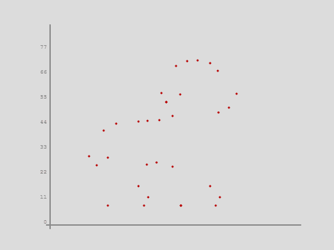

#

```
██████╗██╗     ██╗███████╗███████╗ ██████╗ ██████╗ ██████╗  ██╗ ██████╗ ███╗   ██╗███████╗
██╔════╝██║     ██║██╔════╝██╔════╝██╔═══██╗██╔══██╗██╔══██╗███║██╔═══██╗████╗  ██║██╔════╝
██║     ██║     ██║█████╗  █████╗  ██║   ██║██████╔╝██║  ██║╚██║██║   ██║██╔██╗ ██║█████╗  
██║     ██║     ██║██╔══╝  ██╔══╝  ██║   ██║██╔══██╗██║  ██║ ██║██║   ██║██║╚██╗██║██╔══╝  
╚██████╗███████╗██║██║     ██║     ╚██████╔╝██║  ██║██████╔╝ ██║╚██████╔╝██║ ╚████║███████╗
╚═════╝╚══════╝╚═╝╚═╝     ╚═╝      ╚═════╝ ╚═╝  ╚═╝╚═════╝  ╚═╝ ╚═════╝ ╚═╝  ╚═══╝╚══════╝
```

<div align="center">

**`Diseño Industrial · Interacción · Interfaces · Robots · Código`**

</div>

---

</div>

<div align="center">



</div>


<div align="center">


*Diseñador Industrial, Diseño de Interacción.*

Me interesa el códgio, la experiencia de usuario, los mecanismos, los dispositivos phygital, la electrónica y la exploración audiovisual.

<div align="left">

```js
let profile = {
  background: ["Diseño Industrial", "Diseño de Interacción"],
  interests: ["Diseño UX/UI", "HCI", "Robótica",  "Prototipado", "Electrónica", ],
  stack: ["P5.js", "HTML/CSS/", "Figma", "Rhinoceros 3D", "C++ en Arduino"],
  location: "Chile 🇨🇱",
  mode: "always learning"
};
```

</div>

---

## stack

<div align="center">


</div>

---

## contacto`

<div align="center">

contáctame!

[](mailto:clifford1one@proton.me)
[](https://instagram.com/clifford1one)

</div>

---

<div align="center">

<sub>clifford1one · Chile</sub>

</div>